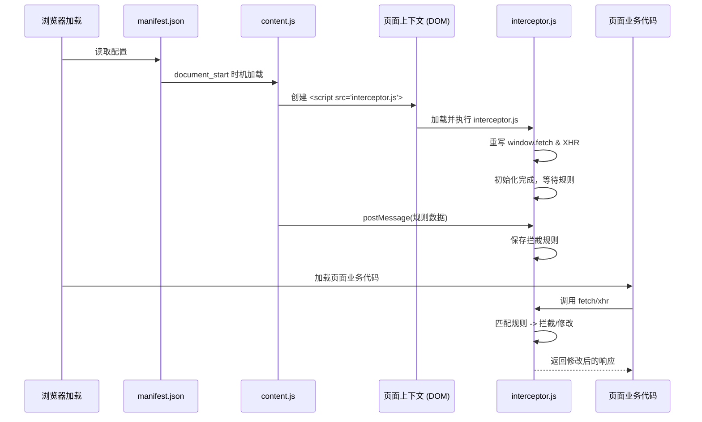

# Chrome 扩展请求拦截机制深度解析

本项目实现“在发起请求前注入拦截脚本并成功拦截”的核心机制可以总结为：**利用 `document_start` 时机注入 Content Script，再由 Content Script 将拦截代码注入到页面上下文（Page Context），最终通过重写原生网络 API 实现拦截。**

以下是具体的关键做法解读：

## 1. 抢占最早执行时机 (`document_start`)

为了确保拦截脚本在页面任何业务代码（包括其他第三方库）执行之前生效，项目在 `manifest.json` 中进行了关键配置：

- **文件**: `public/manifest.json`
- **关键配置**: `run_at: "document_start"`

```json
"content_scripts": [
  {
    "matches": ["<all_urls>"],
    "js": ["content.js"],
    "run_at": "document_start", // 关键：在 DOM 构建开始时立即运行
    "all_frames": true
  }
]
```

这意味着当用户打开网页时，`content.js` 会在 `document.head` 甚至 `document.body` 创建之前就开始执行。

## 2. 突破沙箱限制注入页面上下文

Chrome 扩展的 Content Script 运行在独立的世界（Isolated World）中，无法直接访问页面原本的 `window.fetch` 或 `XMLHttpRequest` 对象。为了拦截页面的网络请求，必须将代码注入到页面的运行上下文（Main World）中。

- **文件**: `public/content.js`
- **做法**: 动态创建 `<script>` 标签并插入到 `document.documentElement`（即 `<html>` 根节点）。

```javascript
function injectedScript(path, root = document.documentElement) {
  const scriptNode = document.createElement("script");
  scriptNode.src = chrome.runtime.getURL(path); // 指向扩展内的 interceptor.js
  root.appendChild(scriptNode); // 插入到 html 节点，确保最早执行
  return scriptNode;
}

// 注入 interceptor.js
const pageScripts = injectedScript("./interceptor.js");
```

由于 `content.js` 是在 `document_start` 时运行的，此时页面 DOM 树刚刚开始构建，插入的脚本会立即被浏览器解析并执行，从而抢在页面原有脚本之前接管环境。

## 3. 重写原生网络 API (Monkey Patching)

实际的拦截逻辑位于 `src/utils/interceptor.ts`（构建后为 `interceptor.js`）。它通过“猴子补丁”（Monkey Patch）的方式，保存原始方法并用自定义方法覆盖全局对象。

- **文件**: `src/utils/interceptor.ts`

### A. 拦截 Fetch API

```typescript
// 保存原始 fetch
this.originalFetch = window.fetch;

// 重写 fetch
window.fetch = async (...args) => {
  // 1. 检查规则匹配
  const matchedRule = this.findMatchingRule(url, init.method || "GET");

  if (matchedRule && matchedRule.enabled) {
    // 2. 修改请求参数 (Request Modification)
    const modifiedRequest = this.modifyRequest(init, matchedRule);

    // 3. 执行原始请求或直接返回模拟响应
    const response = await this.originalFetch.call(
      window,
      input,
      modifiedRequest
    );

    // 4. 修改响应结果 (Response Modification)
    return this.modifyResponse(response, matchedRule);
  }

  // 无规则匹配，透传原始请求
  return this.originalFetch.call(window, ...args);
};
```

### B. 拦截 XMLHttpRequest

```typescript
// 保存原始方法
this.originalXMLHttpRequestOpen = XMLHttpRequest.prototype.open;
this.originalXMLHttpRequestSend = XMLHttpRequest.prototype.send;

// 重写 open 方法 (捕获请求信息)
XMLHttpRequest.prototype.open = function (method, url, ...args) {
  // ... 匹配规则并存储到实例上 ...
  return self.originalXMLHttpRequestOpen.apply(this, [method, url, ...args]);
};

// 重写 send 方法 (修改数据并发送)
XMLHttpRequest.prototype.send = function (data) {
  // ... 修改请求体 ...

  // 重写 onreadystatechange 以拦截响应
  const originalOnReadyStateChange = this.onreadystatechange;
  this.onreadystatechange = function () {
    if (this.readyState === 4) {
      // ... 修改 responseText/response/status ...
      self.modifyXHRResponse(this, matchedRule);
    }
    // ...
  };

  // 发送请求
  self.originalXMLHttpRequestSend.call(this, modifiedData);
};
```

## 4. 跨上下文通信与规则同步

由于 `interceptor.js` 运行在页面上下文，无法直接访问 Chrome 扩展的 `chrome.storage` API。因此，需要通过 `window.postMessage` 与 `content.js` 进行通信。

1.  **Content Script (`content.js`)**: 读取存储中的规则，发送给页面。

    ```javascript
    chrome.storage.local.get(["scriptRequestRules"], (result) => {
      window.postMessage({
        from,
        action: "OPEN_RULES_ENABLED",
        value: scriptRequestRules,
      });
    });
    ```

2.  **Interceptor (`interceptor.ts`)**: 监听消息并更新拦截器配置。
    ```typescript
    window.addEventListener("message", (event) => {
      if (data.action === "RULES_UPDATE") {
        interceptorManager.setRules(data.value);
      }
    });
    ```

## 总结流程图


